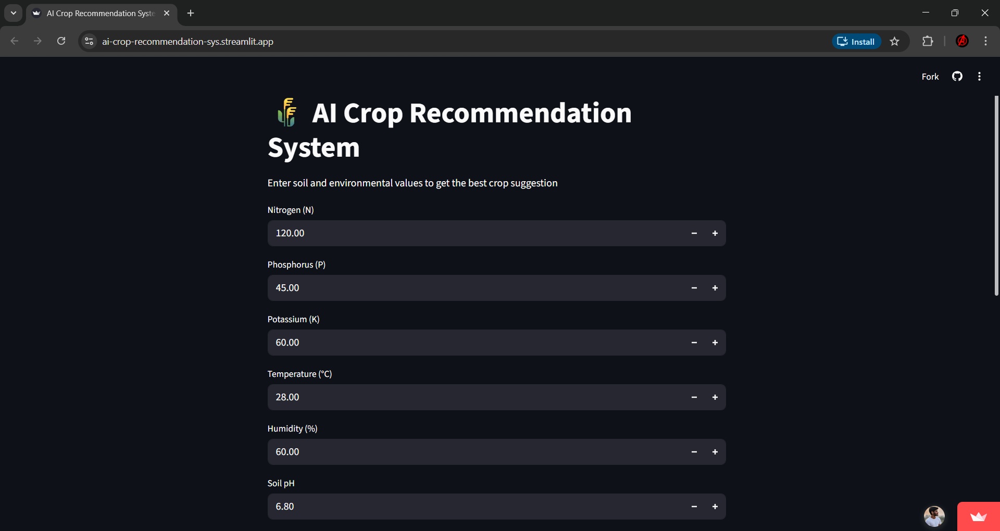
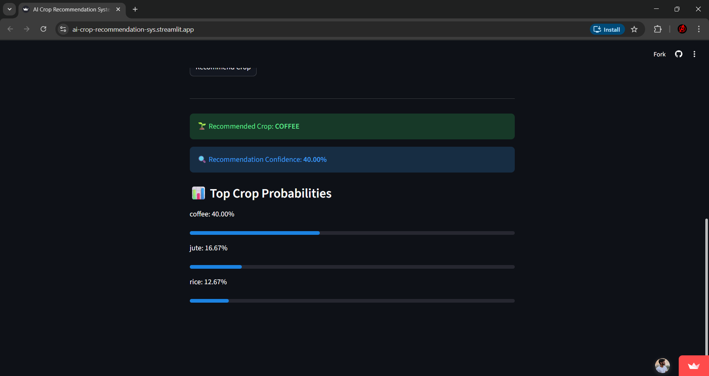

# 🌾 AI Crop Recommendation System

An intelligent machine learning–based system that recommends the most suitable crop based on soil nutrients and environmental conditions.

---

## 🚀 Features

- Predicts the **best crop** using soil and climate data
- Uses **Random Forest Classifier**
- Shows **prediction confidence**
- Displays **Top-3 crop recommendations**
- Interactive **Streamlit web app**

---

## 🧠 Machine Learning Model

- Algorithm: Random Forest Classifier
- Dataset: Kaggle Crop Recommendation Dataset
- Target: Crop Name
- Input Features:
  - Nitrogen (N)
  - Phosphorus (P)
  - Potassium (K)
  - Temperature (°C)
  - Humidity (%)
  - Soil pH
  - Rainfall (mm)

---

## 📂 Dataset

Source: Kaggle – Crop Recommendation Dataset  
The dataset contains soil nutrient values and environmental conditions mapped to suitable crops.

---

## 🖥️ Web Application (Streamlit)

Users can input soil and weather parameters to receive:
- Recommended crop
- Prediction confidence
- Top 3 crop probabilities

---

## 📸 Application Preview

### Prediction Output

